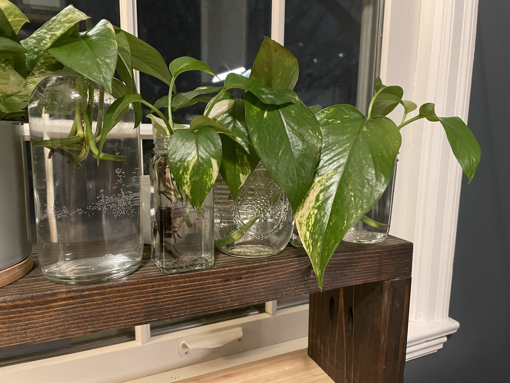

```
{
   "Name": "Noah Ford",
   "Location": "Minneapolis, MN",
   "Occupation": "Data Scientist",
   "Workplace": "Onaroll.co",
   "Hiring?": "Yes, come celebrate shift workers @ https://jobs.lever.co/onaroll", 
   "Hobbies": [
        "Downhill Skiing",
        "Basketball",
        "Meditation & Mindfulness",
        "Taking care of my Pothos (see below!)",
        "Blogging (Time spent tinkering with site > writing)",
        "Weight Lifting (Time spent tinkering with home gym > working out)"
   ],
   "Tech Stack" : {
        "Comfortable": [
            "Python (Pandas, Sci-kit Learn, H3)", 
            "PySpark", 
            "SQL", 
            "BigQuery", 
            "Metabase", 
            "Databricks", 
            "Git",
            "Hugo (This blog)"
        ],
        "Enjoying the journey of learning" : ["Dagster"]
   }
}
```

# What's with the icon?

It's a [_Epipremnum aureum_](https://en.wikipedia.org/wiki/Epipremnum_aureum), but I call it a Pothos or Devil's Ivy. It is **easily** my favorite plant due to its simple beauty and how hard it is to kill! My favorite part is that grows in water just as well as in soil with very little light.




