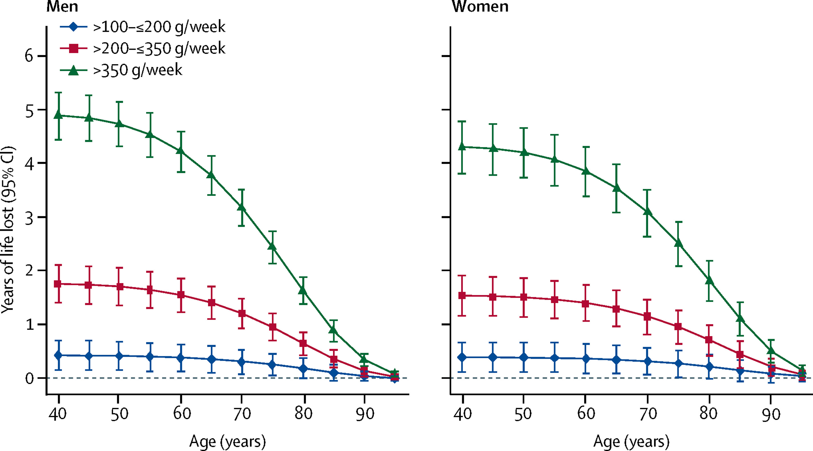

19% of US adults *say* they will participate in Dry January with 52% saying that will abstain completely during this time.  If we are taking them at their word that means ~10% of US adults will *attempt* to completely abstain from alcohol in January.  

Not only will they be missing out on the $15 cocktails I see but in some places, [it might be as high as $20](bonappetit.com/story/expensive-cocktails-cost). 





I took a look at the [hottest cocktail spots in Minneapolis](https://twincities.eater.com/maps/best-new-bars-cocktails-minneapolis-st-paul-twin-cities) and took note of their prices.

# Dollar Value of a Human Life, Drinking, and Life Expectancy
There are many estimates of the monetary value of a human life, also called the value of a statistical life (VLS). We also know how the dollar value one would put on their life changes as one becomes wealthier, which would be the income elasticity as it relates to VLS.

Once we know the VLS and time lost to one drink we can say:

$$C= VT + D$$

where:

$C$: True USD cost of one drink

$V$: USD value of one's life

$T$: % of one's life lost to one drink

$D$: Actual monetary value to buy or make the drink

I'll go through how to best estimate $V$ and $T$ so you can find the true price of one drink based on your situation.

## Value of a Human Life
In this [study by Vanderbilt University](https://law.vanderbilt.edu/phd/faculty/w-kip-viscusi/355_Income_Elasticities_and_Global_VSL.pdf), *Income Elasticities and Global Values of a Statistical Life* they state the following formula[^1]:

$$VSL_{c} = VSL_{US} * (Y_{C}/Y_{US})^{\eta}$$

## Loss in Life Expectancy 

The image[^2] below comes from [a study in *The Lancet*]()

[^1]: Page 42 - https://law.vanderbilt.edu/phd/faculty/w-kip-viscusi/355_Income_Elasticities_and_Global_VSL.pdf
[^2]: Figure 4 - https://www.thelancet.com/journals/lancet/article/PIIS0140-6736(18)30134-X/fulltext